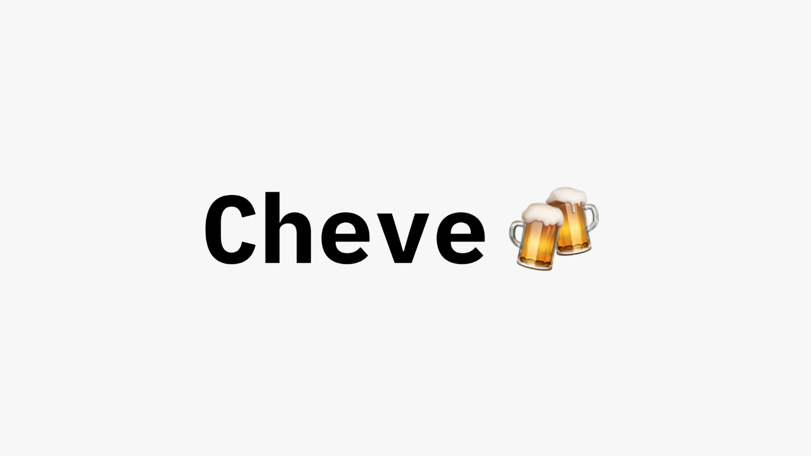

# Cheve

## Description

This repo contains links to all the projects created to build the "cheve" project. To get more information about the details implementation visit the following links.

- [Backend server](https://github.com/manu-yaff/ethmex)
  - Http server that interacts with the smart contract to perform operations on the blockchain. It also provides an API so serve the frontend clients.
- [js frontend client](https://github.com/Elcapi0998/ethMexicoRecyclingWebApp)
  - Represents the recycle machine which allows the user authentication and provide the corresponding reward
- [smart contract](https://github.com/manu-yaff/eth-smart-contract)
- [flutter frontend client](https://github.com/kiwis08/ETHMexico-Cheve)
  - User can scan a code to authentic with the wallet so they can exchange bottles for crypto asset

## Short paragraph

By every ton of glass beer bottles recycled we reduce a total of 1.2 tons of raw material that are used in energy intensive processes. In an impact analysis every beer bottle that is reintroduced into the market saves 1.025 KWh of energy which translates into approximately 430 kg of CO2 emissions removed from the atmosphere. Using products like Cheve is a perfect example of how we can be a contributor into creating sustainable, regenerative and circular economies, while getting rewarded in the process!

# Taget prizes

1. best Refi project
2. best public goods project
3. WalletConnect v1.0 Track
